# How it Works

## Core Concepts

PII-Shield operates on a simple principle: **Intercept -> Analyze -> Redact -> Forward**.

```mermaid
graph LR
    App[Application Pod] -- Raw Logs --> Sidecar(🛡️ PII-Shield)
    Sidecar -- Clean JSON --> Agent[Log Agent]
    Sidecar -- Redacted PII --> Trash((Discarded))
    
    style Sidecar fill:#e1f5fe,stroke:#01579b,stroke-width:2px,color:#01579b
    style App fill:#fff3e0,stroke:#e65100,stroke-width:2px
    style Agent fill:#e8f5e9,stroke:#1b5e20,stroke-width:2px
```

### 1. Entropy Analysis
Regex rules miss things. Developers introduce new keys like `MY_NEW_TOKEN` that traditional filters ignore.

PII-Shield calculates the **Shannon Entropy** of string values.
- `user="john"` -> **Low Entropy** -> Safe ✅
- `token="J8#f9!aZ"` -> **High Entropy** -> Redacted 🛡️

### 2. Context Awareness (Key Matching)
Sometimes sensitive data has low entropy (e.g., a simple password `password=123456`).

PII-Shield scans for sensitive keys (e.g., `password`, `secret`, `auth`, `cvv`) and forces redaction on their values, regardless of complexity.

### 3. Deterministic Hashing (HMAC)
Instead of replacing secrets with `*****`, PII-Shield uses a salted HMAC hash.

- **Input**: `password=MySecret123`
- **Output**: `password=[HIDDEN:8f3a11]`

If the same secret appears again in the logs, it will produce the **same hash**. This is critical for debugging issues in production without exposing raw data.

### 4. JSON Integrity
Many sanitizers use simple regex replacements on the whole line, which can accidentally break JSON syntax (e.g., deleting a closing brace).

PII-Shield parses JSON lines, walks the tree recursively, sanitizes specific values, and serializes it back **ensuring valid JSON output**.
